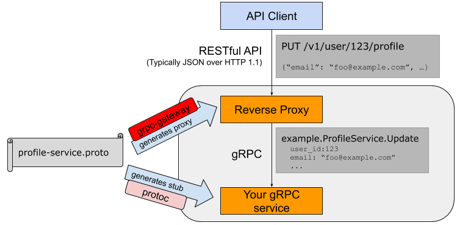
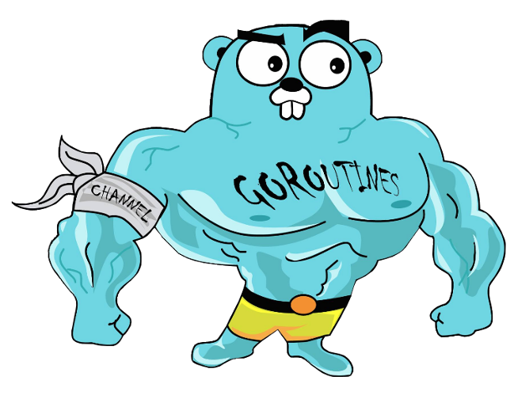

# Introduction

### Golang Siigo Bolt Template Microservice

- API RestFul
- gRPC Gateway
- CQRS Pattern
- Kafka Consumers / Producers (Broker)
- FX Uber Modules
- Logrus Logging
- Go Requests Validators
- CleanEnv configurations
- Mongo Example
- Tested Code

# Quick start development with Docker and Docker Compose

* Create a personal access token (PAT) in [azure devops](https://dev.azure.com/SiigoDevOps/_usersSettings/tokens) and
  replace it in the docker-compose.yaml file.
* exec docker-compose up

# Build / Run / Test

#### Install Dependencies

```
$ make install
```

#### Generate API / grpcGateway

```
$ make generate
```

- Make read every .proto file service definition in proto folder to generate grpcGateway and Swagger

#### Build

```
$ make build
```

#### Run

```
$ make run
```

#### All : install clean generate build and run

```
$ make all
```

#### Check Api Ok

```
$ https://0.0.0.0:11000/api?name=juan  (HTTP)
```

```
$ https://0.0.0.0:11000/ (Swagger)
```

```
$ ghz --call=greeterpb.Greeter/Greeting -d '{"name":"juan"}'  (gRPC)
```

#### Run Tests

```
$ make test
```

#### Test gRPC

```
$ make load_test_grpc
```

#### Test HTTP API

```
$ make load_test_http
```

# Project Structure

```
SIIGO.BOLT.TEMPLATE
├───.docker
├───configuration  ==> cleanEnv yanls configuration
├───images  ==> README.md images
|───internal
│   ├───gateway  ==> gateway mux and handlers
│   ├───statik   ==> generated
|───pkg
│   ├───cqrs         ==> siigo cqrs lib
│   ├───siigokafka   ==> siigo kafka broker lib
|───proto  ==> proto and generated grpc files
|───src  ==> Developer Folder
    ├───api ==>  Service Controllers Implementation
    ├───application     ==> CQRS Application Layer
    │   ├───command     ==> Commands and CommnadHandlers
    │   ├───consumer    ==> Broker Consumers
    │   ├───producer    ==> Broker Producers
    │   ├───query       ==> Query and QueryHandlers
    ├───boot       ==> Startup, Init and Run
    ├───config     ==> Default Configuration
    ├───domain     ==> CQRS Domain Layer
    ├───fxmodule   ==> Dependency Injection FX Uber Configuration
    ├───infrastructure   ==> BBDD, Remote Client or third-party connections
    │   ├───document     ==> NoSQL Documents Definitions
    │   ├───finder       ==> Query Finders
    │   ├───remote       ==> Remote Http o gRPC Clients
    │   ├───repository   ==> Command Repositories
|───third_party     ==> Third Party Go Files
├───config.json     ==> Default configuration
|───go.mod          ==> Go Modules Definitions
|───Makefile        ==> Tasks Makefile Definitions
|───main.go         ==> Main Go File
```

# Requirements

- Golang 1.15.5
- Protoc version 3.13.0
- GNU Make 3.81

## grpc-gateway



    API Client
    Reverse Proxy
    gRPC Gateway

## CQRS Pattern


### CQRS is based in Async Channels Golang Goroutines


```

//Dispatch passes the RequestMessage on to all registered request handlers.
func (b *InMemoryDispatcher) Dispatch(request RequestMessage) (interface{}, error) {
	if handler, ok := b.handlers[request.RequestType()]; ok {
		response := make(chan interface{})
		errs := make(chan error, 1)
		defer close(response)
		defer close(errs)
		go HandleEvent(response, errs, handler, request)
		value:= <-response
		fail :=<-errs
		return value, fail
	}
	return nil, fmt.Errorf("the request bus does not have a handler for request of type: %s", request.RequestType())
}

// Async Channel
func HandleEvent(response chan interface{}, errs chan error, handler IRequestHandler, message RequestMessage){
	value, err := handler.Handle(message)
	errs <- err
	response <- value
}

```

## CQRS Register Command / Queries

```

// Configure Commands
greeterCommandHandler := command.NewGreeterCommandHandlers(&greeterservice.GreeterService{})
_ = dispatcher.RegisterHandler(greeterCommandHandler, &command.GreeterCommand{})

// Configure Queries
fruitsQueryHandler := query.NewFruitQueryHandlers()
_ = dispatcher.RegisterHandler(fruitsQueryHandler, &query.FruitsQuery{})


```

## Config Consumer / Producer Kafka

```

// Configure Consumers and Producers
kafkaConfigMap := &kafka.ConfigMap{
    "bootstrap.servers": "qakafka.siigo.com:9094",
	"group.id":          "greeterSvcLocal",
	"auto.offset.reset": "earliest",
}

// Create Event Consumer as goroutine
go consumer.MakeGoEventConsumer(kafkaConfigMap)

...
_ = consumer.SubscribeTopics([]string{"goTopic", "^aRegex.*[goTt]opic"}, nil)
...

```

## Consumers and Producers are goroutines



## This Template has Auto Swagger Doc API

```
$ https://0.0.0.0:11000/   (Swagger)
```


# Steps to Developers

## 1. Define your service/s in proto file (**services.proto**)

```
syntax = "proto3";

package greeterpb;

import "google/api/annotations.proto";
import "google/protobuf/wrappers.proto";

service Greeter {
  rpc Greeting(GreetingRequest) returns (GreetingResponse) {
    option (google.api.http) = {
      // Route to this method from GET requests to /api
      get: "/api"
      // body: "*"
    };
  }
}

message GreetingRequest {
  string name = 1;
}

message GreetingResponse {
  string greeting = 2;
}


```

## 2. Generate grpc Gateway

```
$ make generate
```

## 3. Register Handler and Server in **src/boot/boot.go**

```
// Register GRPC Handlers
func RegisterGrpcHandlers(conn *grpc.ClientConn, serverMux *runtime.ServeMux) {

	register := gateway.RegisterHandlers(context.Background(), serverMux, conn)

	register(
		pb.RegisterPersonHandler,
		pb.RegisterGreeterHandler, <==  Example  ==>
		pb.RegisterHealthHandler,
		pb.RegisterErrHandler,
	)
}

// Register Protobuf Services
func RegisterGrpcServers(server *grpc.Server, controller *api.Controller) {
	// Register All GrpcServers
	pb.RegisterPersonServer(server, controller)
	pb.RegisterGreeterServer(server, controller) <==  Example  ==>
	pb.RegisterHealthServer(server, controller)
	pb.RegisterErrServer(server, controller)
}

```

## 4. Implements your service in api folder (**greet.go**)

```

package server

import (
	"context"
	"dev.azure.com/SiigoDevOps/Siigo/_git/go-cqrs.git/cqrs"
	"dev.azure.com/SiigoDevOps/Siigo/_git/go-cqrs.git/cqrs/uuid"
	pb "siigo.com/kubgo/proto"
	"siigo.com/kubgo/src/application/command"
)


func (b *Backend) Greeting(ctx context.Context, r *pb.GreetingRequest) (*pb.GreetingResponse, error) {
	b.mu.Lock()
	defer b.mu.Unlock()

	commandMessage := cqrs.NewCommandMessage(uuid.NewUUID(), &command.GreeterCommand{Name: 	r.GetName()})
	greeting , _ := b.bus.Dispatch(commandMessage)
	return &pb.GreetingResponse{ Greeting: greeting.(string)}, nil
}

```

## 5. Create Command or Queries Handlers to Dispatch in Application Layer

### a. Create Command or Query Handler

```

/**************** GREETER COMMAND HANDLER  ******************/
// GreeterCommandHandler provides methods for processing commands related
// to greeter items.
type GreeterCommandHandler struct {
	service greeterservice.Service
}

// NewGreeterCommandHandler a new InventoryCommandHandlers
func NewGreeterCommandHandler(service greeterservice.Service) *GreeterCommandHandler {
	return &GreeterCommandHandler{service: service}
}

// Handle processes inventory item commands.
func (gch *GreeterCommandHandler) Handle(message cqrs.RequestMessage) (interface{}, error) {

	log.Info("<= HANDLE Greeter Command => ")
	// Return Invoking Service Domain
	return gch.service.Greeting(message.Request().(*GreeterCommand).Name), nil
}


```

### b. Instance And Register The Handler in ApplicationModule FX (**fxmodule**)

```
// Application Module Commands And Queries
var ApplicationModule = fx.Options(
	fx.Provide(
		cqrs.NewInMemoryDispatcher,
		greeterservice.NewGreeterService,
		command.NewGreeterCommandHandler,  <== Example ==>
		command.NewPersonCommandHandler,
		query.NewFruitQueryHandler,
		query.NewPersonQueryHandler,
	),
	fx.Invoke(
		RegisterHandlers,
	),
)

// Register Commands and Queries
func RegisterHandlers(dispatcher cqrs.Dispatcher,
	createPersonCommandHandler *command.CreatePersonCommandHandler,
	greeterCommandHandler *command.GreeterCommandHandler,   <== Example ==>
	fruitsQueryHandler *query.FruitQueryHandlers,
	personQueryHandler *query.PersonQueryHandlers,
) {

	// Configure Commands
	_ = dispatcher.RegisterHandler(greeterCommandHandler, &command.GreeterCommand{})   <== Example ==>
	_ = dispatcher.RegisterHandler(createPersonCommandHandler, &command.CreatePersonCommand{})
	// Configure Queries
	_ = dispatcher.RegisterHandler(fruitsQueryHandler, &query.FruitsQuery{})
	_ = dispatcher.RegisterHandler(personQueryHandler, &query.FindAllPersonQuery{})
}

```

# Contribute

- Hernán Camilo Gómez
- Carlos Javier Méndez Vera
- Marcos Vicente Ríos Castro
- Cristian Andrés Collazos Ordóñez
- Diego Hernán Maza
- Hugo Ernesto Cruz Casallas
- Geancarlo Murillo Mendoza
- Miguel Ángel Gómez Espinosa
- Manuel Fernando Zambrano Ceron
- Cristian Alejandro Omaña Chivico
- Ángel Camilo Chávez Moreno
- Jhon Emmanuel Zúñiga Paredes
- Mónica María Jaimes Salcedo
- Jonathan Andrés Cárdenas Pabon
- Juan David Correa Malagón
- Manuel Enrique Ramírez
- Fernando Gutiérrez Paramio
- Andrés Camilo Jiménez

